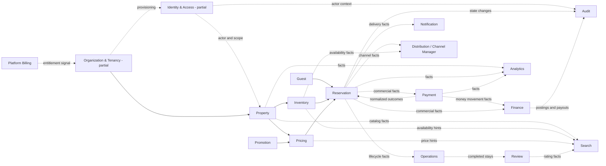

# Bounded-context map

Status: target context relationships; only the Identity & Access and Organization & Tenancy foundations are partial today.

```mermaid
flowchart LR
  identity["Identity & Access - partial"]
  organization["Organization & Tenancy - partial"]
  property[Property]
  inventory[Inventory]
  pricing[Pricing]
  reservation[Reservation]
  guest[Guest]
  payment[Payment]
  finance[Finance]
  operations[Operations]
  notification[Notification]
  search[Search]
  review[Review]
  promotion[Promotion]
  distribution["Distribution / Channel Manager"]
  analytics[Analytics]
  audit[Audit]
  billing[Platform Billing]

  organization -. provisioning .-> identity
  identity -. actor and scope .-> property
  organization --> property
  property --> inventory
  property --> pricing
  promotion --> pricing
  guest --> reservation
  inventory --> reservation
  pricing --> reservation
  payment -. normalized outcomes .-> reservation
  reservation -. commercial facts .-> payment
  payment -. money movement facts .-> finance
  reservation -. commercial facts .-> finance
  reservation -. lifecycle facts .-> operations
  operations -. completed stays .-> review
  property -. catalog facts .-> search
  inventory -. availability hints .-> search
  pricing -. price hints .-> search
  review -. rating facts .-> search
  reservation -. delivery facts .-> notification
  reservation -. channel facts .-> distribution
  inventory -. availability facts .-> distribution
  property -. facts .-> analytics
  reservation -. facts .-> analytics
  payment -. facts .-> analytics
  identity -. actor context .-> audit
  reservation -. state changes .-> audit
  finance -. postings and payouts .-> audit
  billing -. entitlement signal .-> organization
```
