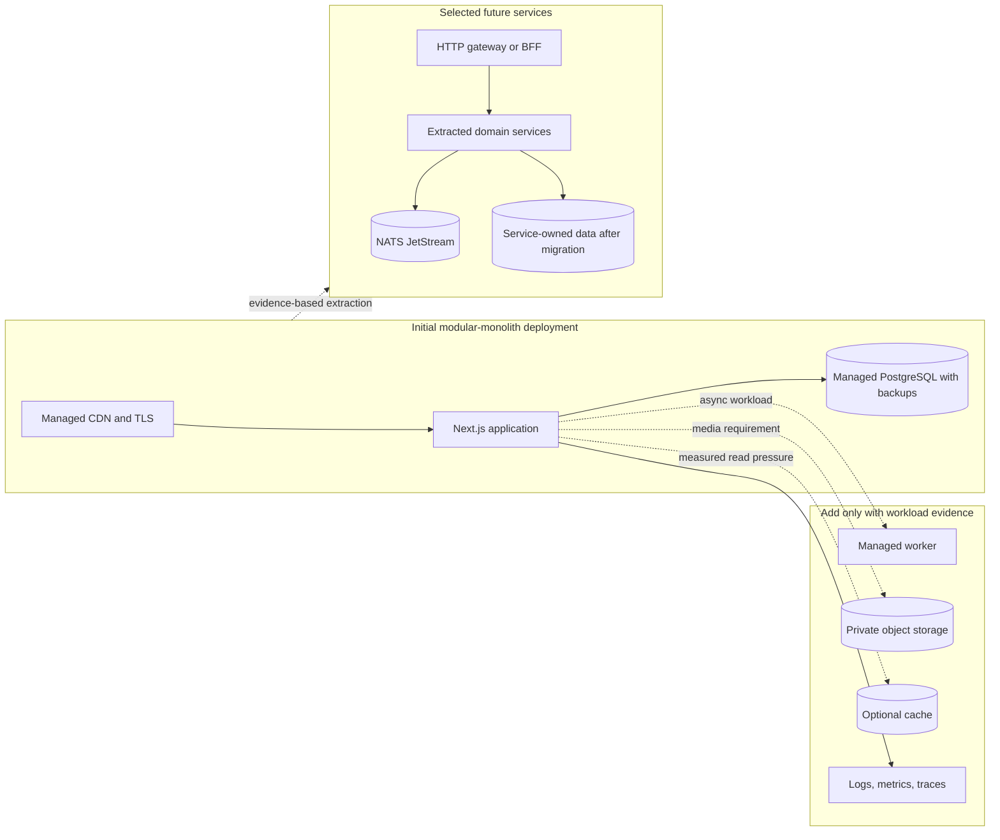

# Deployment evolution

Status: target deployment stages. Production migration or promotion is not authorized by Phase 0.

```mermaid
flowchart LR
  subgraph MVP[Initial modular-monolith deployment]
    edge[Managed CDN and TLS]
    app[Next.js application]
    db[(Managed PostgreSQL with backups)]
    edge --> app
    app --> db
  end

  subgraph Growth[Add only with workload evidence]
    worker[Managed worker]
    storage[(Private object storage)]
    cache[(Optional cache)]
    telemetry[Logs, metrics, traces]
  end

  subgraph Extracted[Selected future services]
    gateway[HTTP gateway or BFF]
    services[Extracted domain services]
    broker[(NATS JetStream)]
    serviceDb[(Service-owned data after migration)]
    gateway --> services
    services --> broker
    services --> serviceDb
  end

  app -. async workload .-> worker
  app -. media requirement .-> storage
  app -. measured read pressure .-> cache
  app --> telemetry
  MVP -. evidence-based extraction .-> Extracted
```
