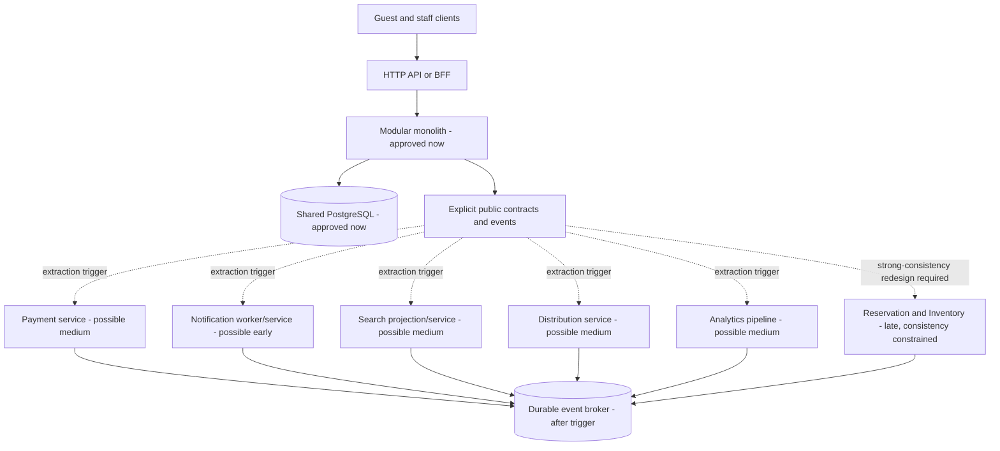

# Future service evolution

Status: evolution path, not a deployment plan. Extraction requires measured triggers.

```mermaid
flowchart TB
  clients[Guest and staff clients]
  bff[HTTP API or BFF]
  monolith[Modular monolith - approved now]
  postgres[(Shared PostgreSQL - approved now)]
  contracts[Explicit public contracts and events]
  payment[Payment service - possible medium]
  notification[Notification worker/service - possible early]
  search[Search projection/service - possible medium]
  distribution[Distribution service - possible medium]
  analytics[Analytics pipeline - possible medium]
  reservation[Reservation and Inventory - late, consistency constrained]
  broker[(Durable event broker - after trigger)]

  clients --> bff
  bff --> monolith
  monolith --> postgres
  monolith --> contracts
  contracts -. extraction trigger .-> payment
  contracts -. extraction trigger .-> notification
  contracts -. extraction trigger .-> search
  contracts -. extraction trigger .-> distribution
  contracts -. extraction trigger .-> analytics
  contracts -. strong-consistency redesign required .-> reservation
  payment --> broker
  notification --> broker
  search --> broker
  distribution --> broker
  analytics --> broker
  reservation --> broker
```
