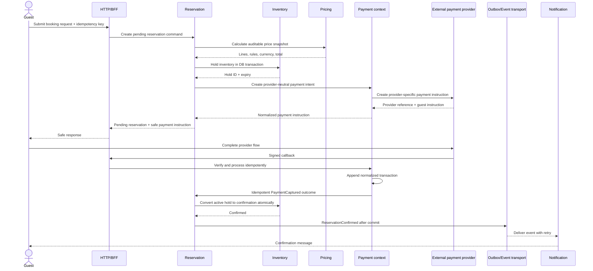

# Reservation confirmation sequence

Status: target-only sequence. No reservation, inventory, pricing, payment, broker, or notification runtime exists.

```mermaid
sequenceDiagram
  actor Guest
  participant API as HTTP/BFF
  participant Reservation
  participant Inventory
  participant Pricing
  participant Payments as Payment context
  participant Provider as External payment provider
  participant Events as Outbox/Event transport
  participant Notification

  Guest->>API: Submit booking request + idempotency key
  API->>Reservation: Create pending reservation command
  Reservation->>Pricing: Calculate auditable price snapshot
  Pricing-->>Reservation: Lines, rules, currency, total
  Reservation->>Inventory: Hold inventory in DB transaction
  Inventory-->>Reservation: Hold ID + expiry
  Reservation->>Payments: Create provider-neutral payment intent
  Payments->>Provider: Create provider-specific payment instruction
  Provider-->>Payments: Provider reference + guest instruction
  Payments-->>Reservation: Normalized payment instruction
  Reservation-->>API: Pending reservation + safe payment instruction
  API-->>Guest: Safe response
  Guest->>Provider: Complete provider flow
  Provider->>API: Signed callback
  API->>Payments: Verify and process idempotently
  Payments->>Payments: Append normalized transaction
  Payments->>Reservation: Idempotent PaymentCaptured outcome
  Reservation->>Inventory: Convert active hold to confirmation atomically
  Inventory-->>Reservation: Confirmed
  Reservation->>Events: ReservationConfirmed after commit
  Events-->>Notification: Deliver event with retry
  Notification-->>Guest: Confirmation message
```
