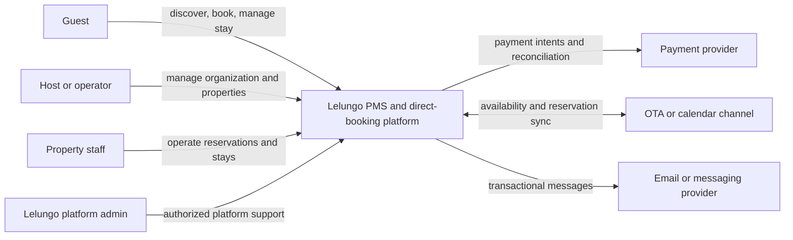

# Lelungo system context

Status: target product context; only the legacy guest prototype and tenancy/RBAC foundation are currently implemented.

```mermaid
flowchart LR
  guest[Guest]
  host[Host or operator]
  staff[Property staff]
  admin[Lelungo platform admin]
  payment[Payment provider]
  ota[OTA or calendar channel]
  notification[Email or messaging provider]
  lelungo[Lelungo PMS and direct-booking platform]

  guest -->|discover, book, manage stay| lelungo
  host -->|manage organization and properties| lelungo
  staff -->|operate reservations and stays| lelungo
  admin -->|authorized platform support| lelungo
  lelungo -->|payment intents and reconciliation| payment
  lelungo <-->|availability and reservation sync| ota
  lelungo -->|transactional messages| notification
```
